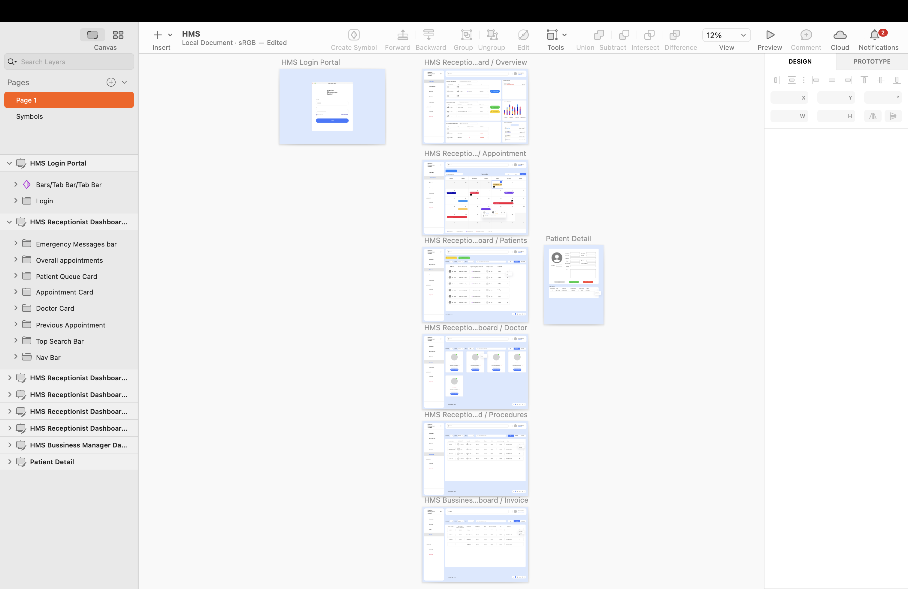

# Hosipital Management System - Interface Design & System Analysis Coursework
## Overview
A comprehensive system analysis and interface design project for a hospital management system, developed as part of the Object-Oriented Systems course at Mohawk College. The project focuses on creating an intuitive and efficient interface for managing patient records, appointments, and medical procedures.

## My Contribution
- Collaborated with team members to develop comprehensive functional requirements
- Designed the complete user interface system using Sketch, including:
  - Role-based dashboards for medical staff, receptionists, and business managers
  - Patient registration and management interfaces
  - Appointment scheduling system
  - Medical procedure tracking
  - Invoice management system

## Project Scope
- System Analysis
  - Functional requirements identification
  - Use case analysis
  - User story development
- Interface Design
  - User flow mapping
  - Dashboard design
  - Navigation system
  - Forms and data entry interfaces
  - Reporting screens

## Tools Used
- Sketch (UI Design)
- Draw.io (System Analysis)

## Project Demonstration

### Sketch Screenshot

